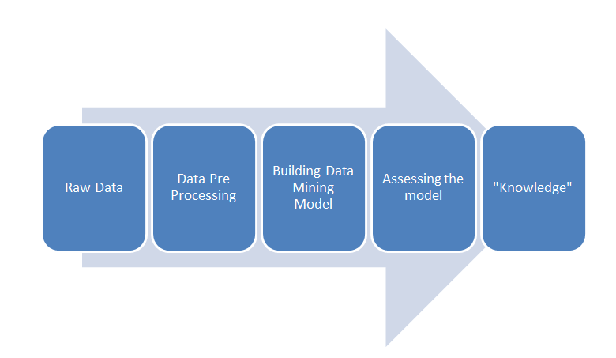

# Data Mining

Data Mining là khai thác dữ liệu.

Data Mining là quá trình tìm kiếm các mẫu từ tập dữ liệu lớn (Data Set) và phân tích dữ liệu từ những quan điểm khác nhau. Nó cho phép người dùng trong doanh nghiệp dùng để phân tích dữ liệu từ nhiều góc độ khác nhau và tóm tắt các mối quan hệ xác định (relationship).

Data Mining rất hữu ích trong việc tăng doanh thu và cắt giảm chi phí.

Ví dụ:
> Trong một siêu thị, người mua bàn chải đánh răng vào ngày chủ nhật cũng mua kem đánh răng. Thông tin này có thể được sử dụng trong việc tăng doanh thu bằng cách đặt 2 sản phẩm này cạnh nhau. Việc đó sẽ thúc đẩy việc tăng số lượng bán ra của 2 loại sản phẩm đó nhiều hơn vào những ngày chủ nhật.

Khái niệm về khai phá dữ liệu (Data Mining) hay khám phá tri thức (Knowledge Discovery) có rất nhiều cách diễn đạt khác nhau nhưng về bản chất đó là quá trình tự động trích xuất thông tin có giá trị (Thông tin dự đoán - Predictive Information) ẩn chứa trong khối lượng dữ liệu khổng lồ trong thực tế.

```mermaid
A [Data (Information)] --> B [Data Mining] --> C [Models (Knowledge)];
```
Data mining nhấn mạnh 2 khía cạnh chính đó là khả năng trích xuất thông tin có ích Tự động (Automated) và thông tin mang tính dự đoán (Predictive).



## Tại sao cần khai phá dữ liệu (Data mining)
Hiện nay với sự phát triển ngành công nghiệp, mạng xã hội bùng nổ, thông tin, dữ liệu có mặt và xuất hiện xung quanh chúng ta. Sự gia tăng bùng nổ của dữ liệu từ mức độ terabytes đến mức độ petabytes.

Thu thập dữ liệu và sự tồn tại của dữ liệu: các công cụ thu thập dữ liệu tự động, các hệ thống cơ sở dữ liệu, world wide web, xã hội số, facebook v.v.v

Các nguồn dữ liệu phong phú:
- Kinh doanh: internet, thương mại điện tử, giao dịch thương mại, chứng khoán.
- Khoa học: tín hiệu cảm biến, thí nghiệm mô phỏng/ giả lập.
- Xã hội: tin tức, máy ảnh số, các mạng xã hội.

Chúng ta hoàn toàn bị tràn ngập trong dữ liệu, các dữ liệu rất quan trọng, bị bỏ thừa và không được tận dụng hết nguồn dữ liệu lớn. Do đó chúng ta cần khai phá, phân tích dữ liệu để tìm kiếm và khám phá ra những điều đã bỏ lỡ, những tri thức.

***Nói tóm gọn lại:*** Khai phá dữ liệu (Data mining) là rút trích dữ liệu hoặc các *tri thức quan trọng* từ một lượng dữ liệu khổng lồ. Và quan trọng ở đây là không tầm thường, ẩn, chưa được biết đến và mang tính hữu ích trong quá trình phân tích.

***Phân tích dữ liệu và hỗ trợ quyết định:***
- Phân tích và quản lý thị trường: Quảng cáo cá nhân (target marketing), Quản lý quan hệ khách hàng (CRM), phân tích thị trường, phân tích giỏ hàng, phân tích bán hàng, sự phân chia thị trường.
- Phân tích và quản lý rủi ro: dự đoán, giữ khách hàng, phân tích cạnh tranh.
- Phát hiện gian lận và các mẫu giá trị bất thường (outliers)

***Các ứng dụng khác:***
- Khai phá văn bản (nhóm tin, email, tài liệu v.v.v)
- Khai phá web
- Khai phá dữ liệu luồng (chuỗi) v.v.v

Và thông thường sau những lợi ích trên thì mọi người sẽ đặt câu hỏi dữ liệu lấy từ đâu?? Nguồn dữ liệu được tập hợp từ nhiều nguồn ví dụ như các giao dịch sử dụng thẻ tín dụng cũng là nguồn dữ liệu, các cuộc gọi phàn nàn từ khách hàng, các thẻ khách hàng thường xuyên, các phiếu giảm giá , những kiểu khách hàng nào mua những mặt hàng nào v.v.v đó là những nguồn dữ liệu mà bạn có thể tận dụng để phân tích trong môi trường kinh doanh cạnh tranh khốc liệt như hiện nay.

***Các vấn đề thách thức:*** và để làm được chuyện trên thì chúng ta phải trải qua nhiều quy trình.
- Tính hiệu quả và tính ổn định của các giải thuật khai phá dữ liệu.
- Xử lý với dữ liệu có số chiều, số thuộc tính lớn
- Xử lý dữ liệu chứa nhiều lỗi, không chắc chắn, không hoàn chỉnh
- Tích hợp khai phá dữ liệu và các thiết bị hoạt động
- Bảo đảm tính an ninh, toàn vẹn, riêng tư trong khai phá dữ liệu


## Ứng dụng của Data Mining:

### Kinh doanh - thương mại:
- Xác định thói quen mua hàng của khách hàng
- Dự đoán chu kỳ kinh doanh sản phẩm
- Liên hệ giữa khách hàng và các yếu tố khác
- Xác định loại khách hàng tiềm năng, đối tượng có khả năng trở thành khách hàng
- Dự đoán hiệu quả của một đợt quảng cáo, tiếp thị

### Thương mại điện tử:
- Phân tích hành động duyệt Web để phát triển sở thích của khách hàng --> Cải thiện hoạt động Website...

### Ngân hàng:
- Dự đoán các dấu hiệu của một giao dịch trái luật
- Xác định các khách hàng sẽ cộng tác lâu dài
- Dự đoán rủi ro của các khoản cho vay
- Xác định các nhân tố dẫn đến vỡ nợ vay
- Liên hệ giữa các chỉ số tài chính với hoạt động ngân hàng

### Viễn thông:
- Nhận biết các dấu hiệu của sự gian lận dịch vụ
- Xu thế phát triển khách hàng, đối tượng, khu vực cần phát triển
 
### Bảo hiểm:
- Loại khách hàng có rủi ro cao? Gian lận?
- Liệu khách hàng có thực hiện hết hợp đồng bảo hiểm?
- Đối tượng, vùng nào có khả năng tham gia bảo hiểm?

### Y tế:
- Chuẩn đoán bệnh qua các triệu chứng
- Liên hệ giữa các loại bệnh
- Dự đoán hiệu quả của một cuộc phẫu thuật, điều trị

## Quy trình khai thác dữ liệu (Data Mining Process)

Data Mining phân tích các mối quan hệ và các mẫu trong các dữ liệu được lưu trữ dựa trên các truy vấn của người dùng. Khai thác dữ liệu liên quan đến những nhiệm vụ như sau:

- Association (Kết hợp): Tìm mối quan hệ giữa các biến.
> Ví dụ như trong một cửa hàng bán lẻ, có thể xác định sản phẩm được mua cùng với nhau thường xuyên và thông tin này có thể được sử dụng để tiếp thị các sản phẩm này.

- Clustering (Phân cụm): Xác định mối quan hệ hợp lý trong các sản phẩm và nhóm chúng lại với nhau.
> Ví dụ như trong một cửa hàng bán lẻ, kem đánh răng và bàn chải đánh răng có thể được nhóm lại.

- Classifying (Phân loại): Liên quan đến việc áp dụng một mô hình được biết đến với các dữ liệu mới.

## Các kỹ thuật cần sử dụng

Data mining liên quan chặt chẽ đến các lĩnh vực sau:
- Statistics (Thống kê): Kiểm định mô hình và đánh giá tri thức phát hiện ra
- Machine Learning (Máy học): Nghiên cứu xây dựng các giải thuật trên nền tảng của trí tuệ nhân tạo giúp cho máy tính có thể suy luận, dự đoán kết quả tương lai thông qua quá trình huấn luyện từ dữ liệu lịch sử.
- Database (Cở sở dữ liệu): Công nghệ quản trị dữ liệu, nhất là kho dữ liệu - data warehouse
- Visualization (Trực quan hóa): Giúp dữ liệu dễ hiểu, dễ sử dụng như chart, map

## Các kỹ thuật Data Mining

### Descriptive Data Mining

- Gom nhóm, phân cụm, nhận dạng
- Cây quyết định
- Khai phá luật kết hợp
- Phân tích sự phát triển và độ lệch
- Thống kê

### Predictive Data Mining

- Phân lớp, máy học, hệ chuyên gia
- Thống kê hồi quy
- Mạng nơ-ron
- Giải thuật di truyền

## Một số thuật toán phổ biến được dùng trong Data Mining

- Descision tree: Cây quyết định (Classification Task)
- Nearest Neighbor: Láng giềng gần nhất (Classification Task)
- Neural Network: Mạng Neural (Classification and Clustering Task)
- Rule Induction: Luật quy nạp (Classification Task)
- K-Means: Thuật toán K-Means (Clustering Task)

## Các công cụ Data Mining

***Các yêu cầu đối với bộ công cụ khai phá dữ liệu:***
- một giao diện trực quan cho phép người dùng tận dụng các thuật toán thống kê và khai thác dữ liệu mà không cần lập trình.
- cung cấp thuật toán để xây dựng mô hình dự báo và mô tả, cùng với một giao diện đồ họa và các yếu tố khác để hợp lý hóa quá trình khai thác dữ liệu ngay từ khâu chuẩn bị dữ liệu để tìm ra mô hình cho kết quả tốt nhất.
- hiệu suất cao
- mô hình dự báo có thể sẽ được tích hợp trong thời gian thực và tự động cập nhật.
- Có khả năng cho điểm

***Các tính năng cần có của bộ công cụ khai phá dữ liệu:***
- Các tính năng bao gồm: tự động phân loại, phân nhóm tự động, phát hiện bất thường, apriori, mạng Bayes , Carma, hồi quy Cox, danh sách quyết định, phân tích nhân tố / PCA, lựa chọn tính năng, K- phương tiện, Kohonen, hai bước, phân biệt, máy vector hỗ trợ(SVM ), KNN, mạng Nơ-ron.
- Các chức năng khai thác dữ liệu: thuộc tính quan trọng, phân khúc, phân nhóm, dự báo, và các dữ liệu luật kết hợp.

***Các định dạng dữ liệu được dùng để khai phá:***
- Dữ liệu văn bản
- Dữ liệu lưu trong định dạng excel.
- Dữ liệu SQL

## Referral:
- [Data Mining là gì?](http://forums.bsdinsight.com/threads/data-mining-la-gi.1007/)
- [Tại sao cần khai phá dữ liệu (Data mining)](http://forums.bsdinsight.com/threads/tai-sao-can-khai-pha-du-lieu-data-mining.7830/)
- [Khai phá dữ liệu – Data Mining là gì?](http://kythuatlaptrinh.com/2016/11/29/khai-pha-du-lieu-data-mining-la-gi/)

